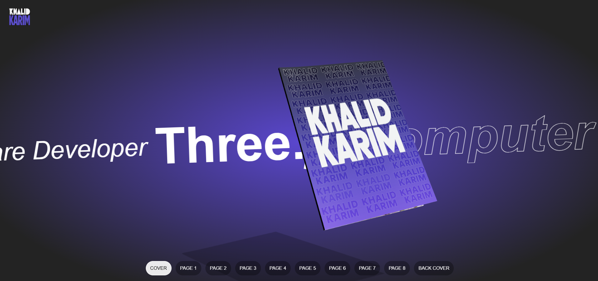
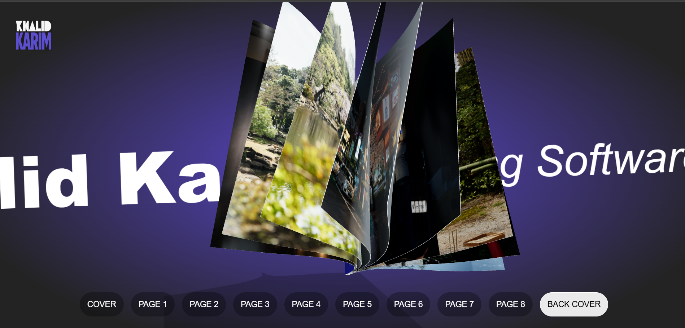

<div align="center">

# 📘 3D Book Slider three.js 📘

### A stunning 3D book experience built with React Three Fiber


</div>

<div align="center">
  
   
</div>

<div align="center">
  
  <p><em>Loading interactive book preview...</em></p>
</div>


## ✨ Features

- 📖 Realistic 3D page turning with physics
- 🖱️ Interactive navigation controls
- 🔊 Immersive page-flip sound effects
- 🎨 Customizable content (images, textures)
- ⚡ 60fps smooth animations
- 📱 Responsive design

## 🛠 Tech Stack

| Component       | Technology                     |
|-----------------|--------------------------------|
| Framework       | React, Vite                    |
| 3D Engine       | Three.js + React Three Fiber   |
| Physics         | Custom vertex shaders          |
| State Management| Jotai                          |
| Styling         | Tailwind CSS                   |
| Audio           | Web Audio API                  |

## 🎮 How to Use

### Basic Navigation
- Click on page corners to turn pages naturally
- Use the bottom navigation panel to jump to specific pages
- The book will smoothly animate to your selected page

### Adding Your Content
- Replace images in `public/textures/` with your own
- Update the `pictures` array in `UI.jsx` with your filenames
- Customize the book appearance by editing parameters in `Book.jsx`
  
### In Book.jsx, you can adjust these parameters:
```javascript
  // Physical properties
  const PAGE_WIDTH = 1.28;          // Book width
  const PAGE_HEIGHT = 1.71;         // Book height
  const PAGE_DEPTH = 0.003;         // Page thickness
  
  // Animation properties
  const PAGE_SEGMENTS = 30;         // Page detail level
  const easingFactor = 0.5;         // Page turning speed
  const insideCurveStrength = 0.18; // Page bending intensity
```

## 🖥 Local Setup

### Prerequisites

- Node.js ≥16.x
- Modern browser with WebGL 2.0 support
- GPU with hardware acceleration


### Installation

1. **Clone the repository**
   ```bash
   git clone https://github.com/your-username/3d-book-slider.git
   cd 3d-book-slider
   ```

2. **Install dependencies**
   ```bash
   npm install
   ```
3. **Start the development server**
  ```bash
   npm run dev
```
4. **Open your browser to**
   ```bash
   http://localhost:5173
   ```


## 🤝 Contributing

We welcome contributions from the community! To contribute to this project:

```bash
# 1. Fork the repository
# (Click the 'Fork' button at the top-right of the GitHub repository)

# 2. Clone your forked repository
git clone https://github.com/YOUR-USERNAME/3d-book-slider.git
cd 3d-book-slider

# 3. Create a new feature branch
git checkout -b feature/your-feature-name

# 4. Make your changes and commit them
git add .
git commit -m "feat: add your amazing feature"

# 5. Push to your branch
git push origin feature/your-feature-name
```
